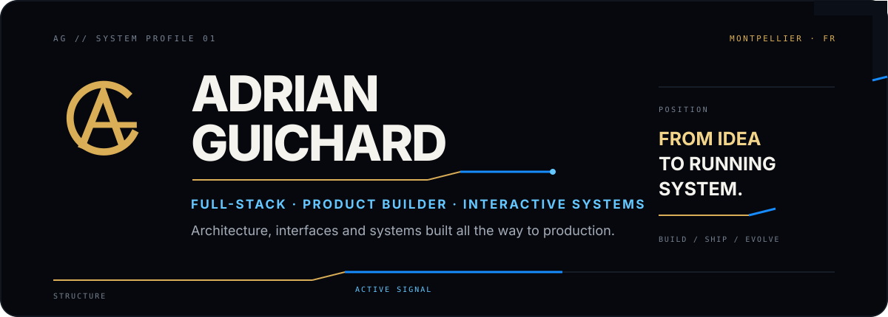
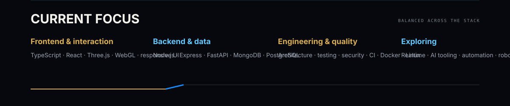
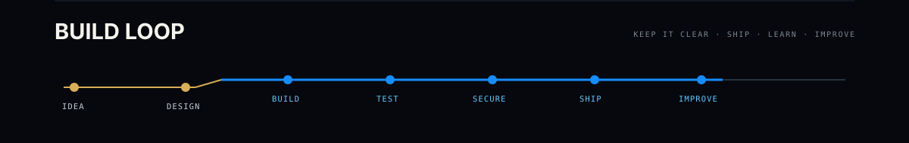
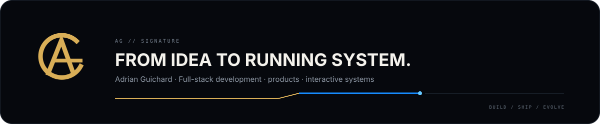

  <picture>
    <source media="(prefers-color-scheme: light) and (max-width: 640px)" srcset="./assets/brand/hero-mobile-light.svg" />
    <source media="(prefers-color-scheme: light)" srcset="./assets/brand/hero-light.svg" />
    <source media="(max-width: 640px)" srcset="./assets/brand/hero-mobile.svg" />
    
  </picture>

  <a href="#about"><strong>About</strong></a>
  &nbsp;&nbsp;·&nbsp;&nbsp;
  <a href="#focus"><strong>Focus</strong></a>
  &nbsp;&nbsp;·&nbsp;&nbsp;
  <a href="#workflow"><strong>Workflow</strong></a>
  &nbsp;&nbsp;·&nbsp;&nbsp;
  <a href="#toolkit"><strong>Toolkit</strong></a>
  &nbsp;&nbsp;·&nbsp;&nbsp;
  <a href="https://adrianguichard.dev"><strong>Portfolio</strong></a>

## About

I'm **Adrian Guichard**, a self-taught **full-stack JavaScript / TypeScript developer** based in Montpellier, France. I started with frontend and interaction, then kept expanding toward backend, data, testing, security and delivery to better understand the whole product.

  <picture>
    <source media="(prefers-color-scheme: light) and (max-width: 640px)" srcset="./assets/brand/focus-mobile-light.svg" />
    <source media="(prefers-color-scheme: light)" srcset="./assets/brand/focus-light.svg" />
    <source media="(max-width: 640px)" srcset="./assets/brand/focus-mobile.svg" />
    
  </picture>

  <picture>
    <source media="(prefers-color-scheme: light) and (max-width: 640px)" srcset="./assets/brand/workflow-mobile-light.svg" />
    <source media="(prefers-color-scheme: light)" srcset="./assets/brand/workflow-light.svg" />
    <source media="(max-width: 640px)" srcset="./assets/brand/workflow-mobile.svg" />
    
  </picture>

  <strong>Clear structure</strong> · understand the whole path · test, secure, ship · learn and improve

## Toolkit

**Frontend** — `TypeScript` `JavaScript` `React` `Vite` `Three.js` `WebGL`  
**Backend & realtime** — `Node.js` `Express` `FastAPI` `REST` `WebSocket` `Nakama`  
**Data** — `PostgreSQL` `MongoDB`  
**Quality & delivery** — `Playwright` `Vitest / Jest` `GitHub Actions` `Docker` `Linux` `pnpm`

<strong>More tools & experience</strong>

 

**Web** — Angular · Vue · Next.js · Astro · Tailwind CSS · styled-components · Axios · Mongoose · MongoDB driver · Zod · JWT · bcrypt  
**AI & local tooling** — Python · PyTorch · Diffusers · local models · CLI workflows  
**Code quality** — ESLint · Prettier · Gitleaks

<strong>Learning & exploring</strong>

 

Realtime systems · automation · local AI · application security · production hardening · robotics · simulation

I’m still expanding my scope step by step. The goal isn’t to collect technologies — it’s to become more capable of building complete systems while keeping them understandable.

  <em>Still learning. Still building. Understanding a little more of the whole system each time.</em>

  <picture>
    <source media="(prefers-color-scheme: light) and (max-width: 640px)" srcset="./assets/brand/footer-mobile-light.svg" />
    <source media="(prefers-color-scheme: light)" srcset="./assets/brand/footer-light.svg" />
    <source media="(max-width: 640px)" srcset="./assets/brand/footer-mobile.svg" />
    
  </picture>

  <a href="https://adrianguichard.dev">Portfolio</a>
  &nbsp;&nbsp;·&nbsp;&nbsp;
  <a href="https://www.linkedin.com/in/adrianguichard/">LinkedIn</a>
  &nbsp;&nbsp;·&nbsp;&nbsp;
  <a href="mailto:adrian34470@gmail.com">Email</a>

