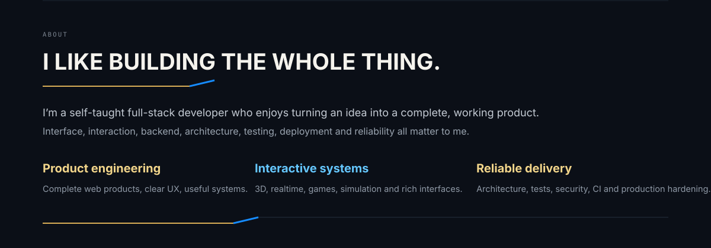
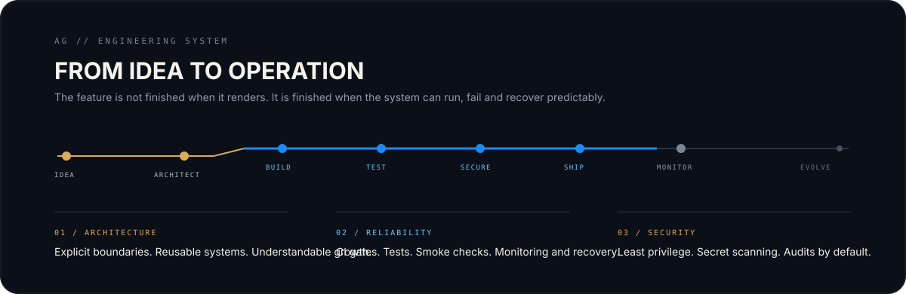
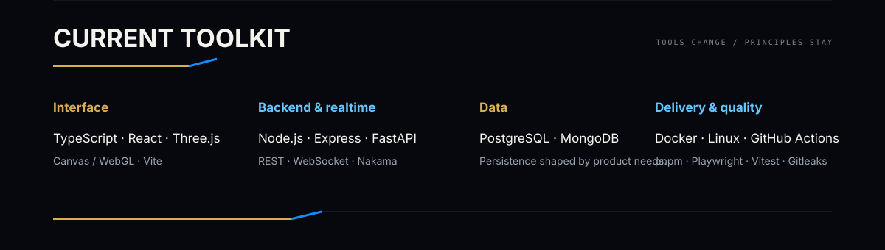

  <picture>
    <source media="(max-width: 640px)" srcset="./assets/brand/hero-mobile.svg" />
    
  </picture>

  
  
  
  

  <picture>
    <source media="(max-width: 640px)" srcset="./assets/system/about-mobile.svg" />
    
  </picture>

  <picture>
    <source media="(max-width: 640px)" srcset="./assets/system/engineering-mobile.svg" />
    
  </picture>

  <picture>
    <source media="(max-width: 640px)" srcset="./assets/system/core-stack-mobile.svg" />
    
  </picture>

  <picture>
    <source media="(max-width: 640px)" srcset="./assets/brand/footer-mobile.svg" />
    
  </picture>

  
  
  

