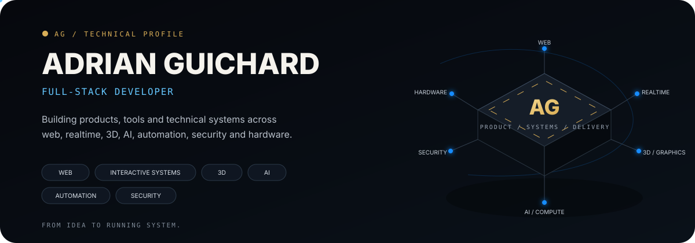
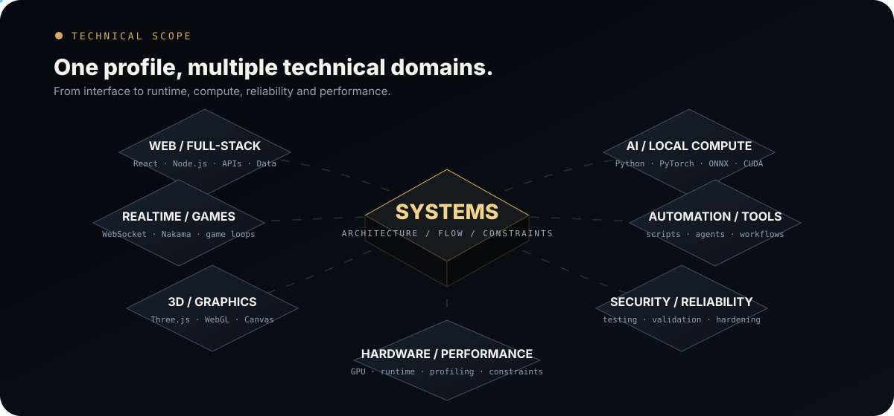
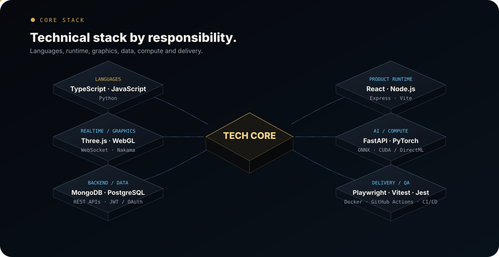
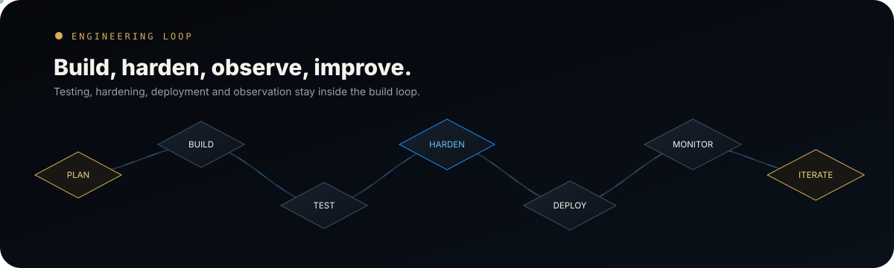
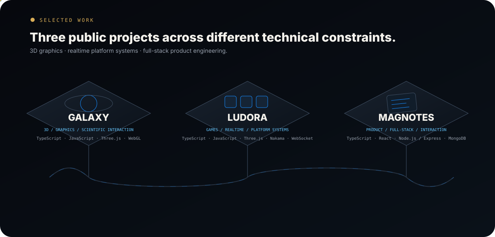
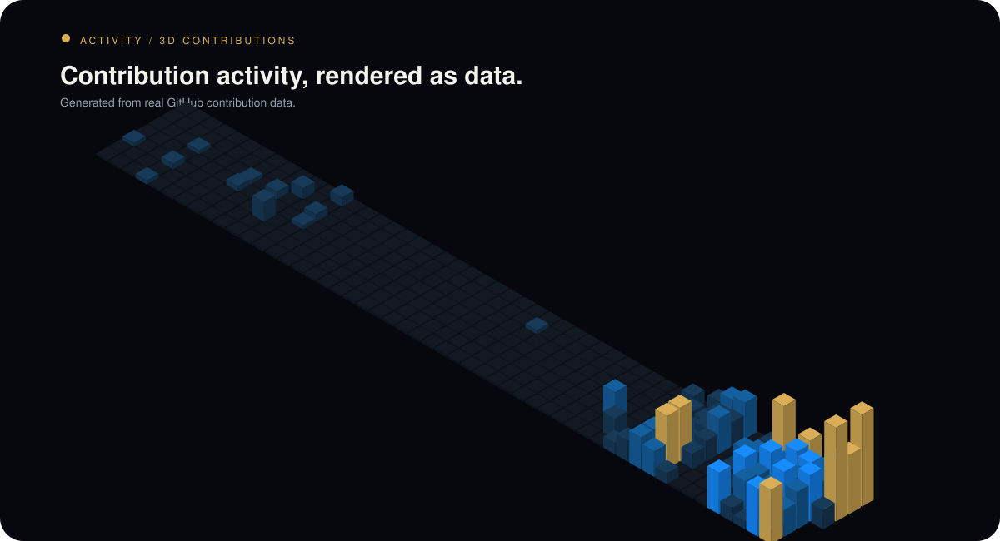
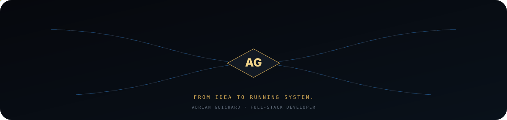

<!-- profile-v2-experimental -->

  <picture>
    <source media="(max-width: 640px)" srcset="./assets/profile-v2/hero-mobile.svg" />
    
  </picture>

  <a href="#scope">Scope</a> ·
  <a href="#stack">Stack</a> ·
  <a href="#engineering">Engineering</a> ·
  <a href="#work">Selected Work</a> ·
  <a href="#activity">Activity</a> ·
  <a href="#contact">Contact</a>

I build **web products, interactive systems and technical tools** across frontend, backend, realtime, 3D, AI/local compute, automation, security and engineering workflows.

My core is TypeScript/JavaScript, with Python where compute, tooling or AI workloads call for it. I care about the whole path from an idea to a system that can be **tested, hardened, deployed, observed and improved**.

  <picture>
    <source media="(max-width: 640px)" srcset="./assets/profile-v2/scope-mobile.svg" />
    
  </picture>

  <picture>
    <source media="(max-width: 640px)" srcset="./assets/profile-v2/stack-mobile.svg" />
    
  </picture>

<strong>Stack detail</strong>

 

**Languages** — TypeScript · JavaScript · Python  
**Product runtime** — React · Node.js · Express · Vite  
**Interactive** — Three.js · WebGL · Canvas · realtime/game logic  
**Backend & data** — MongoDB · PostgreSQL · FastAPI · REST APIs · WebSocket · authentication  
**Compute** — PyTorch · Diffusers · ONNX Runtime · CUDA / DirectML  
**Engineering** — Playwright · Vitest · Jest · Docker · GitHub Actions · CI/CD · Linux  

**Also worked with** — Vue · Next.js · Astro · React Native · Java / Spring Boot · Prisma · Mongoose · Tailwind · Firebase · Caddy · Nginx

  <picture>
    <source media="(max-width: 640px)" srcset="./assets/profile-v2/engineering-mobile.svg" />
    
  </picture>

  <picture>
    <source media="(max-width: 640px)" srcset="./assets/profile-v2/selected-work-mobile.svg" />
    
  </picture>

  <a href="https://galaxy.adrianguichard.dev"><strong>Galaxy</strong></a>
  &nbsp;·&nbsp;
  <a href="https://github.com/Addey34/galaxy-3d">source</a>
  &nbsp;&nbsp;|&nbsp;&nbsp;
  <a href="https://ludora.adrianguichard.dev"><strong>Ludora</strong></a>
  &nbsp;·&nbsp;
  <a href="https://github.com/Addey34/ludora-showcase">showcase</a>
  &nbsp;&nbsp;|&nbsp;&nbsp;
  <a href="https://magnotes.adrianguichard.dev"><strong>MagNotes</strong></a>
  &nbsp;·&nbsp;
  <a href="https://github.com/Addey34/magnotes-frontend">source</a>

  <picture>
    <source media="(max-width: 640px)" srcset="./assets/profile-v2/activity-mobile.svg" />
    
  </picture>

  <a href="https://adrianguichard.dev"><strong>Portfolio</strong></a>
  &nbsp;·&nbsp;
  <a href="https://www.linkedin.com/in/adrianguichard/"><strong>LinkedIn</strong></a>
  &nbsp;·&nbsp;
  <a href="mailto:adrian34470@gmail.com"><strong>Email</strong></a>
  &nbsp;·&nbsp;
  <a href="https://github.com/Addey34"><strong>GitHub</strong></a>

  <picture>
    <source media="(max-width: 640px)" srcset="./assets/profile-v2/footer-mobile.svg" />
    
  </picture>

