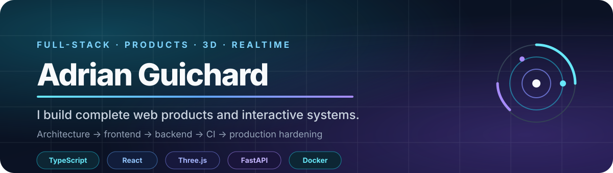

  

  <a href="https://adrianguichard.dev"><strong>Portfolio</strong></a>
  ·
  <a href="https://www.linkedin.com/in/adrianguichard/"><strong>LinkedIn</strong></a>
  ·
  <a href="mailto:adrian34470@gmail.com"><strong>Email</strong></a>

  Building web products, developer tools and interactive 3D experiences with a strong focus on architecture, reliability and production quality.

---

## 🚀 Featured builds

| Project | Product | Engineering focus |
| --- | --- | --- |
| 🌌 **[Galaxy](https://galaxy.adrianguichard.dev/)** | Interactive 3D solar-system explorer | TypeScript · Three.js · astronomical data · Playwright |
| 🎮 **[Ludora](https://ludora.adrianguichard.dev/)** | Browser gaming platform | TypeScript · realtime · Nakama · PWA · [showcase](https://github.com/Addey34/ludora-showcase) |
| 🧠 **[MagNotes](https://magnotes.adrianguichard.dev/)** | Visual knowledge workspace | React · Node.js · MongoDB · Docker |
| 🛡️ **[SiteGuardian](https://siteguardian.adrianguichard.dev/)** | Website monitoring product | TypeScript · PostgreSQL · Stripe · CI |
| ✨ **Image Generator Local** | Hybrid local/hosted generative-AI studio | Python · FastAPI · PyTorch · Diffusers |
| 📄 **[DevisFlow](https://devisflow.adrianguichard.dev/)** | Quote and follow-up product | TypeScript · Vite · domain-oriented architecture |

---

## ⚙️ Core stack

**Frontend**  
`TypeScript` · `JavaScript` · `React` · `Vite` · `Three.js` · `Canvas / WebGL`

**Backend & systems**  
`Node.js` · `Express` · `FastAPI` · `REST` · `WebSocket` · `Nakama`

**Data & delivery**  
`MongoDB` · `PostgreSQL` · `Docker` · `Linux` · `GitHub Actions`

**Quality**  
`pnpm` · `Playwright` · `Vitest / Jest` · `ESLint` · `Prettier` · `Gitleaks`

---

## 🧭 Engineering style

I prefer systems that stay understandable as they grow.

- strict typing and explicit architecture;
- reusable platform layers instead of duplicated feature code;
- CI gates before merge;
- security-minded defaults and secret scanning;
- graceful degradation for optional network features;
- smoke tests, monitoring and reproducible deployment paths.

---

## 📊 Public GitHub snapshot

  

  Generated by this repository's own GitHub Actions workflow from the public GitHub REST API.

---

## 🤝 Contact

  <strong>Web product · interactive experience · full-stack system · technical collaboration</strong>

  <a href="https://adrianguichard.dev">adrianguichard.dev</a>
  ·
  <a href="https://www.linkedin.com/in/adrianguichard/">LinkedIn</a>
  ·
  <a href="mailto:adrian34470@gmail.com">adrian34470@gmail.com</a>

