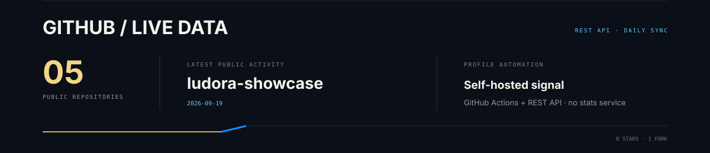

  <picture>
    <source media="(max-width: 640px)" srcset="./assets/brand/hero-mobile.svg" />
    
  </picture>

  
  
  
  

  <picture>
    <source media="(max-width: 640px)" srcset="./assets/system/what-i-build-mobile.svg" />
    
  </picture>

  <picture>
    <source media="(max-width: 640px)" srcset="./assets/system/product-ecosystem-mobile.svg" />
    
  </picture>

---

\n\n## Featured systems

  

  

  

  

  

  

  
    <a href="https://github.com/Addey34/galaxy-3d">Galaxy source</a>
    ·
    <a href="https://github.com/Addey34/ludora-showcase">Ludora showcase</a>
    ·
    <a href="https://github.com/Addey34/magnotes-frontend">MagNotes frontend</a>
  

---

## Engineering

  <picture>
    <source media="(max-width: 640px)" srcset="./assets/system/engineering-mobile.svg" />
    
  </picture>

  <picture>
    <source media="(max-width: 640px)" srcset="./assets/system/core-stack-mobile.svg" />
    
  </picture>

---

## Public telemetry

  <picture>
    <source media="(max-width: 640px)" srcset="./assets/github/telemetry-mobile.svg" />
    
  </picture>

  Generated from public GitHub data by this repository's own GitHub Actions workflow.

---

  <picture>
    <source media="(max-width: 640px)" srcset="./assets/brand/footer-mobile.svg" />
    
  </picture>

  
  
  

