

  <picture>
    <source media="(prefers-color-scheme: light) and (max-width: 640px)" srcset="./assets/brand/v83/composed/hero-mobile-light.svg" />
    <source media="(prefers-color-scheme: light)" srcset="./assets/brand/v83/composed/hero-light.svg" />
    <source media="(max-width: 640px)" srcset="./assets/brand/v83/composed/hero-mobile.svg" />
    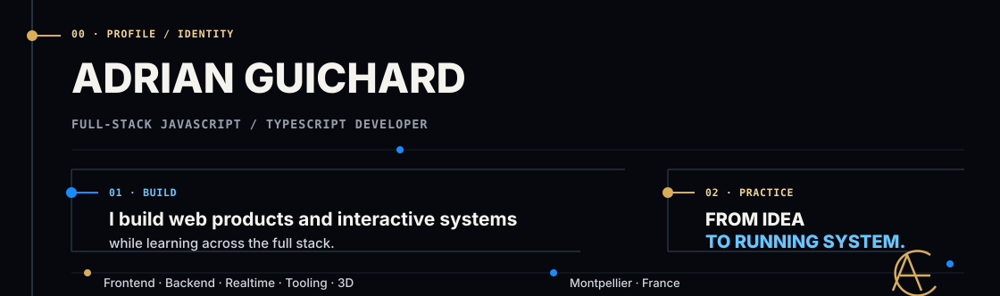
  </picture>

  <a href="#about"><picture><source media="(prefers-color-scheme: light)" srcset="./assets/brand/v83/actions/about-light.svg" />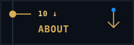</picture></a>
  <a href="#current"><picture><source media="(prefers-color-scheme: light)" srcset="./assets/brand/v83/actions/current-light.svg" />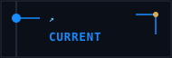</picture></a>
  <a href="#workflow"><picture><source media="(prefers-color-scheme: light)" srcset="./assets/brand/v83/actions/workflow-light.svg" />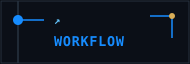</picture></a>
  <a href="#toolkit"><picture><source media="(prefers-color-scheme: light)" srcset="./assets/brand/v83/actions/toolkit-light.svg" />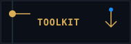</picture></a>
  <a href="https://adrianguichard.dev"><picture><source media="(prefers-color-scheme: light)" srcset="./assets/brand/v83/actions/portfolio-light.svg" />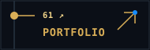</picture></a>

  <picture>
    <source media="(prefers-color-scheme: light) and (max-width: 640px)" srcset="./assets/brand/v83/composed/about-mobile-light.svg" />
    <source media="(prefers-color-scheme: light)" srcset="./assets/brand/v83/composed/about-light.svg" />
    <source media="(max-width: 640px)" srcset="./assets/brand/v83/composed/about-mobile.svg" />
    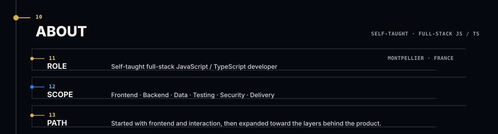
  </picture>

  <picture>
    <source media="(prefers-color-scheme: light) and (max-width: 640px)" srcset="./assets/brand/v83/composed/current-mobile-light.svg" />
    <source media="(prefers-color-scheme: light)" srcset="./assets/brand/v83/composed/current-light.svg" />
    <source media="(max-width: 640px)" srcset="./assets/brand/v83/composed/current-mobile.svg" />
    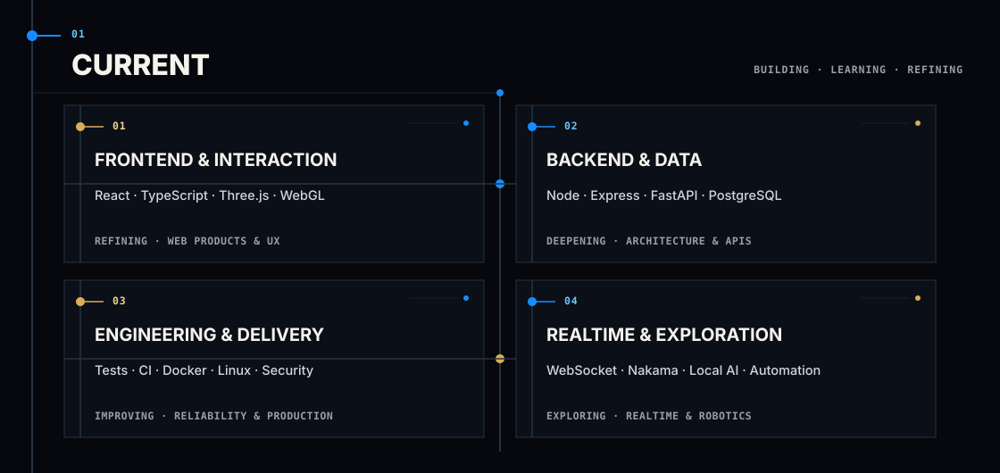
  </picture>

  <picture>
    <source media="(prefers-color-scheme: light) and (max-width: 640px)" srcset="./assets/brand/v83/composed/workflow-mobile-light.svg" />
    <source media="(prefers-color-scheme: light)" srcset="./assets/brand/v83/composed/workflow-light.svg" />
    <source media="(max-width: 640px)" srcset="./assets/brand/v83/composed/workflow-mobile.svg" />
    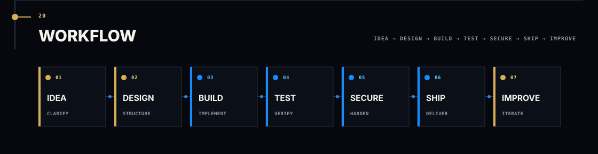
  </picture>

  <picture>
    <source media="(prefers-color-scheme: light) and (max-width: 640px)" srcset="./assets/brand/v83/composed/toolkit-mobile-light.svg" />
    <source media="(prefers-color-scheme: light)" srcset="./assets/brand/v83/composed/toolkit-light.svg" />
    <source media="(max-width: 640px)" srcset="./assets/brand/v83/composed/toolkit-mobile.svg" />
    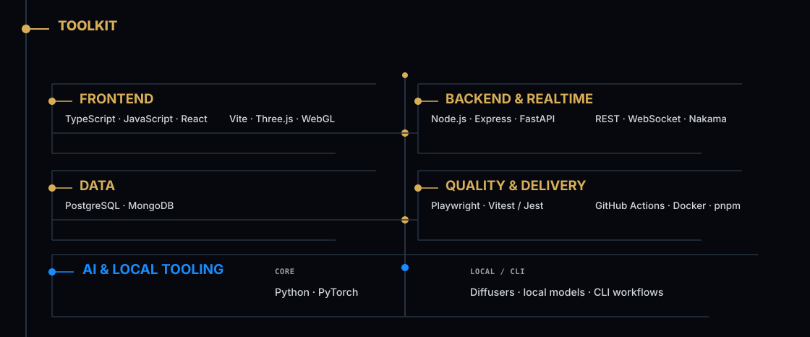
  </picture>

  <picture>
    <source media="(prefers-color-scheme: light) and (max-width: 640px)" srcset="./assets/brand/v83/composed/more-mobile-light.svg" />
    <source media="(prefers-color-scheme: light)" srcset="./assets/brand/v83/composed/more-light.svg" />
    <source media="(max-width: 640px)" srcset="./assets/brand/v83/composed/more-mobile.svg" />
    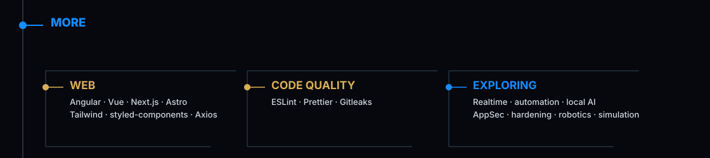
  </picture>

  <a href="https://adrianguichard.dev"><picture><source media="(prefers-color-scheme: light)" srcset="./assets/brand/v83/actions/portfolio-light.svg" /></picture></a>
  <a href="https://www.linkedin.com/in/adrianguichard/"><picture><source media="(prefers-color-scheme: light)" srcset="./assets/brand/v83/actions/linkedin-light.svg" /></picture></a>
  <a href="mailto:adrian34470@gmail.com"><picture><source media="(prefers-color-scheme: light)" srcset="./assets/brand/v83/actions/email-light.svg" />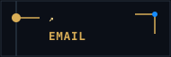</picture></a>

  <picture>
    <source media="(prefers-color-scheme: light) and (max-width: 640px)" srcset="./assets/brand/v83/composed/footer-mobile-light.svg" />
    <source media="(prefers-color-scheme: light)" srcset="./assets/brand/v83/composed/footer-light.svg" />
    <source media="(max-width: 640px)" srcset="./assets/brand/v83/composed/footer-mobile.svg" />
    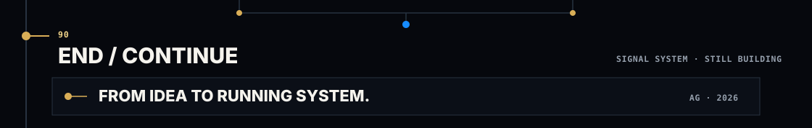
  </picture>

