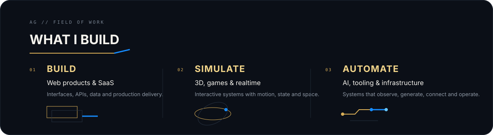
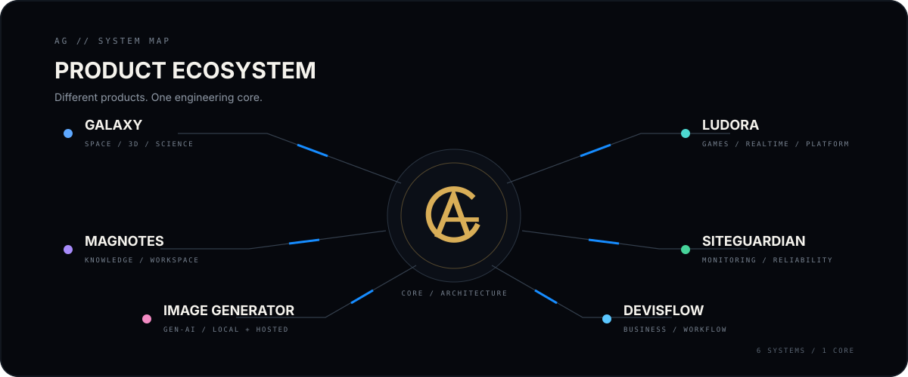
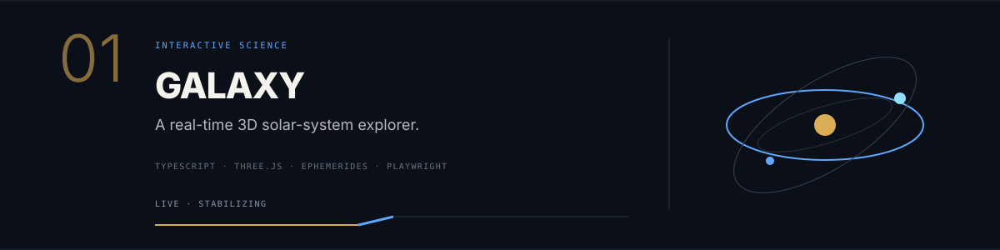
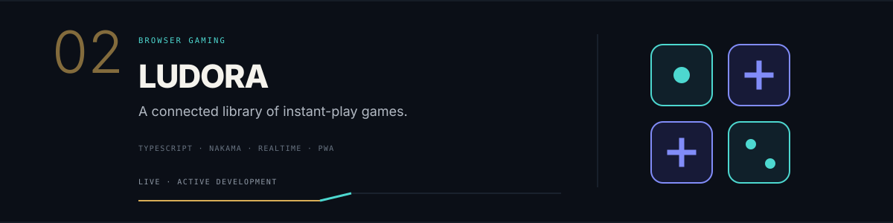
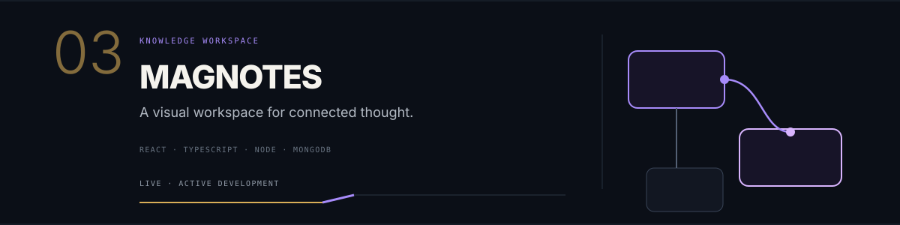
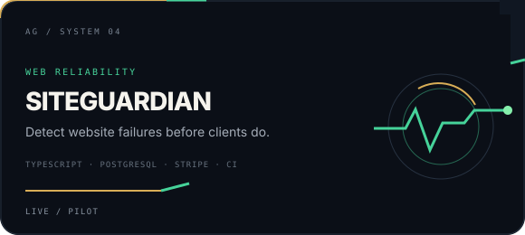
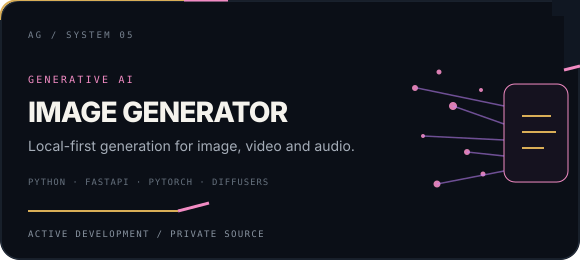
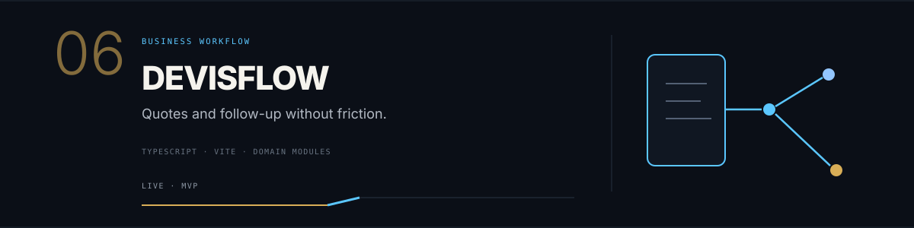
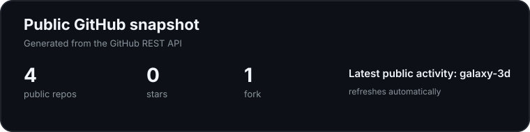

  

  
  
  
  

  

  

---

## Featured builds

  
  

  
  

  
  

  
    <a href="https://github.com/Addey34/galaxy-3d">Galaxy source</a>
    ·
    <a href="https://github.com/Addey34/ludora-showcase">Ludora showcase</a>
    ·
    <a href="https://github.com/Addey34/magnotes-frontend">MagNotes frontend</a>
  

---

## ⚙️ Core stack

**Frontend**  
`TypeScript` · `JavaScript` · `React` · `Vite` · `Three.js` · `Canvas / WebGL`

**Backend & systems**  
`Node.js` · `Express` · `FastAPI` · `REST` · `WebSocket` · `Nakama`

**Data & delivery**  
`MongoDB` · `PostgreSQL` · `Docker` · `Linux` · `GitHub Actions`

**Quality**  
`pnpm` · `Playwright` · `Vitest / Jest` · `ESLint` · `Prettier` · `Gitleaks`

---

## 🧭 Engineering style

I prefer systems that stay understandable as they grow.

- strict typing and explicit architecture;
- reusable platform layers instead of duplicated feature code;
- CI gates before merge;
- security-minded defaults and secret scanning;
- graceful degradation for optional network features;
- smoke tests, monitoring and reproducible deployment paths.

---

## 📊 Public GitHub snapshot

  

  Generated by this repository's own GitHub Actions workflow from the public GitHub REST API.

---

## 🤝 Contact

  <strong>Web product · interactive experience · full-stack system · technical collaboration</strong>

  <a href="https://adrianguichard.dev">adrianguichard.dev</a>
  ·
  <a href="https://www.linkedin.com/in/adrianguichard/">LinkedIn</a>
  ·
  <a href="mailto:adrian34470@gmail.com">adrian34470@gmail.com</a>

