# AG Signal V8.2 — full modular preview

> Prototype only. No public README changes.

# CLEAN

## Signal Clean — About

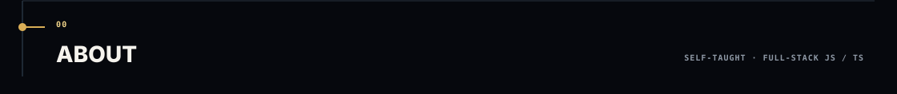

  
  

## Signal Clean — Current

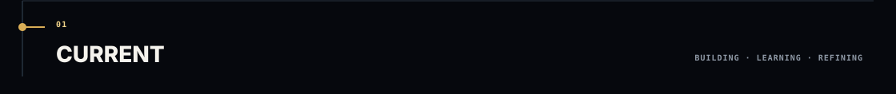

  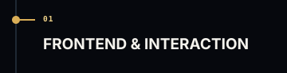
  
  

  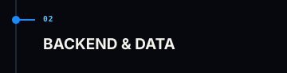
  
  

  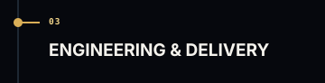
  
  

  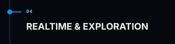
  
  

## Signal Clean — Workflow

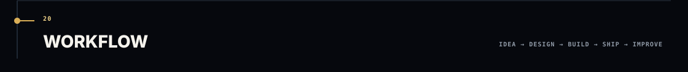

  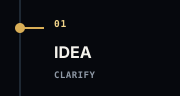
  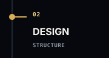
  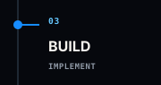
  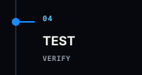
  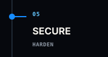
  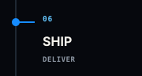
  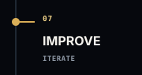

## Signal Clean — Toolkit

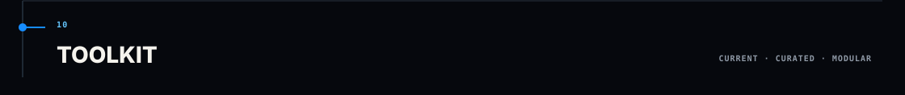

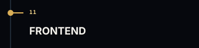  

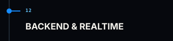  

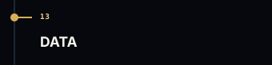 

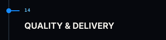  

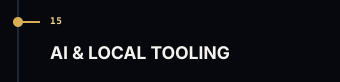  

## Signal Clean — Actions

  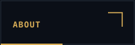
  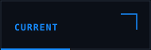
  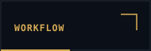
  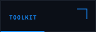
  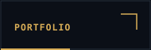
  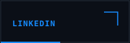
  

# DENSE

## Signal Dense — About

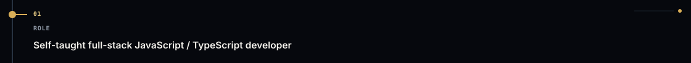

  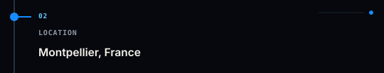
  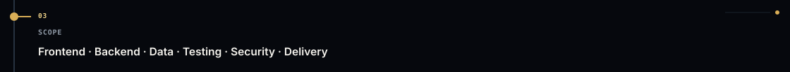

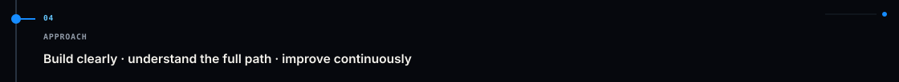

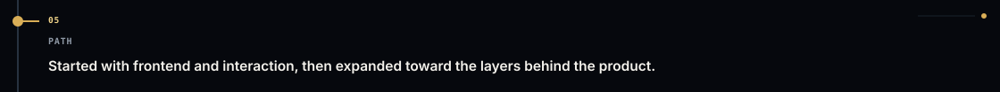

## Signal Dense — Current

  
  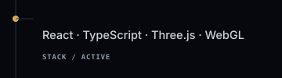
  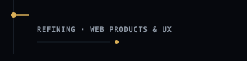

  
  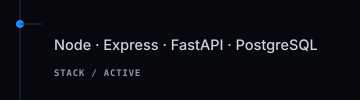
  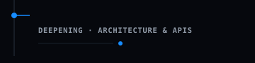

  
  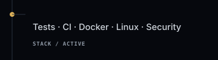
  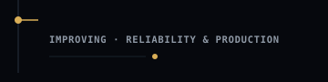

  
  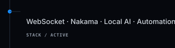
  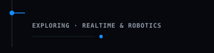

## Signal Dense — Workflow

  
  
  
  
  
  
  

## Signal Dense — Toolkit

 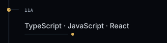 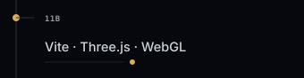

 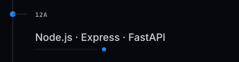 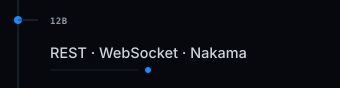

 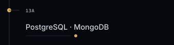

 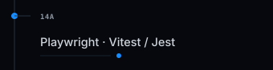 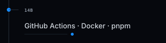

 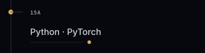 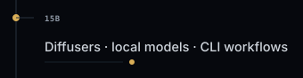

## Signal Dense — Actions

  
  
  
  
  
  
  

