# AG Signal V8.2 — recommended full profile composition

> Prototype composition only. The public README is unchanged.

This preview intentionally mixes the two densities while keeping every asset independent.

---

## Hero

  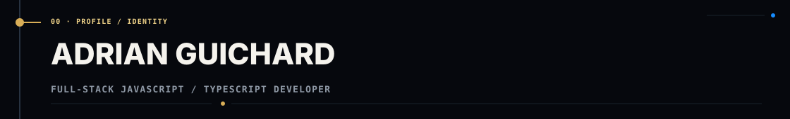

  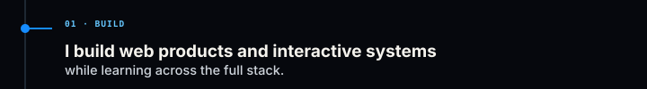
  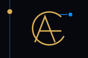

  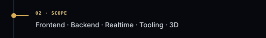
  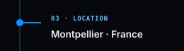
  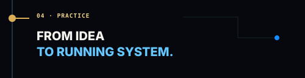

## Navigation

  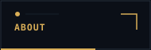
  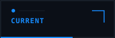
  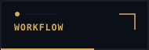
  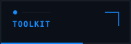
  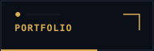

---

## About

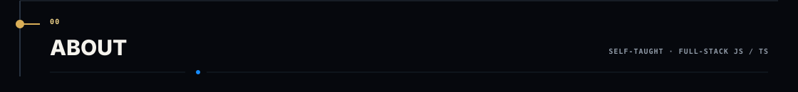

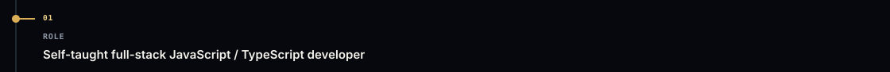

  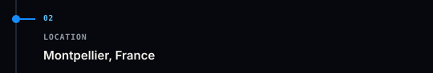
  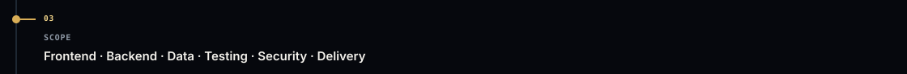

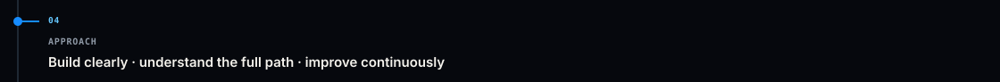

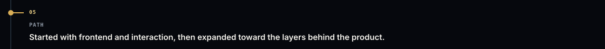

---

## Current

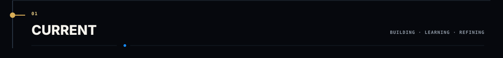

### Frontend

  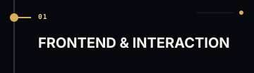
  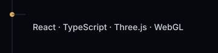
  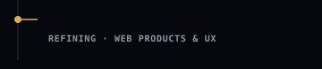

### Backend

  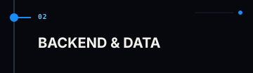
  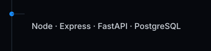
  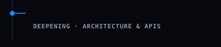

### Engineering

  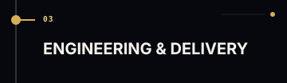
  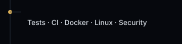
  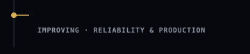

### Exploration

  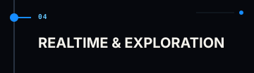
  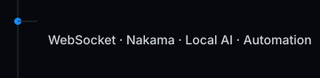
  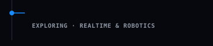

---

## Workflow

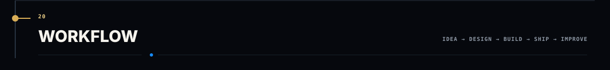

  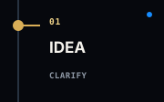
  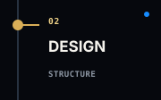
  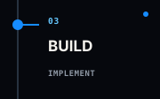
  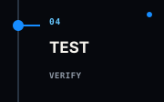
  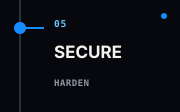
  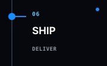
  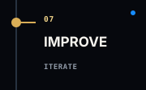

---

## Toolkit

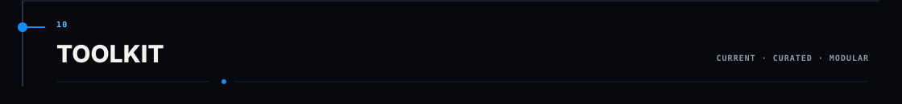

  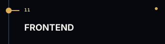
  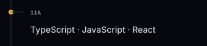
  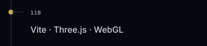

  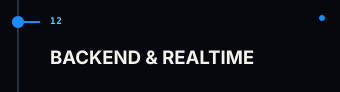
  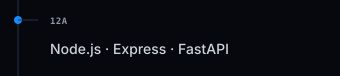
  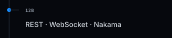

  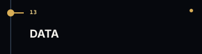
  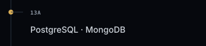

  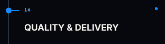
  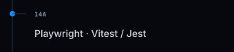
  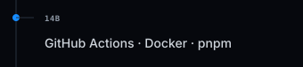

  
  
  

---

## Contact / footer

  
  
  

  
  

